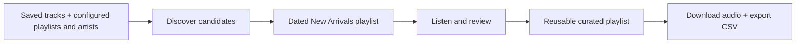
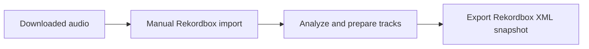
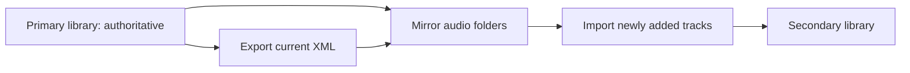
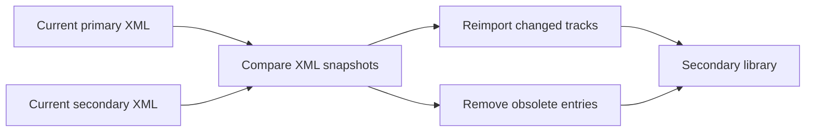
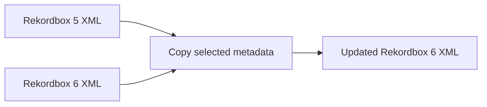
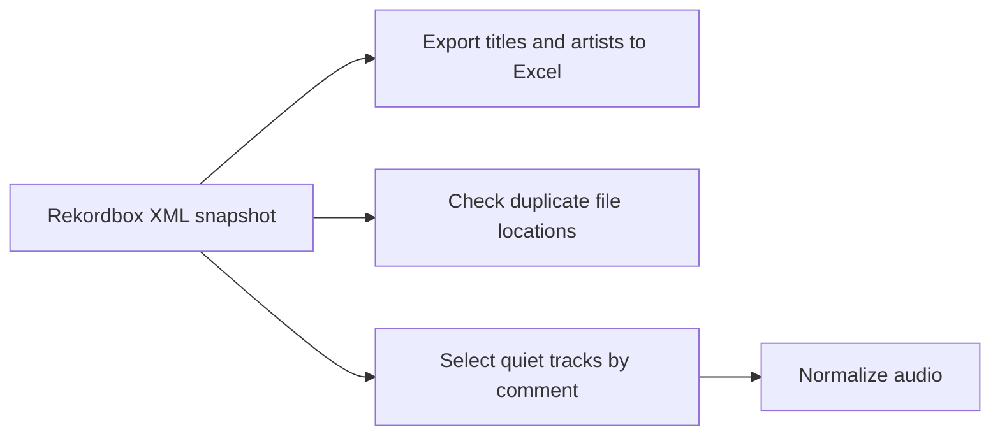

# Song-Manager at a glance

Song-Manager supports the following music-library workflows:

| Feature | Status |
| --- | --- |
| Discover and acquire tracks from Spotify | Operational |
| Prepare the DJ library in Rekordbox | Manual |
| Distribute the library across devices | Operational |
| Refresh secondary-library metadata | Manual |
| Migrate legacy Rekordbox XML | Manual / legacy |
| Run health checks on the Rekordbox library | Partial — see individual checks below |

## Core workflows

### 1. Discover and acquire tracks

The discovery service reads saved tracks and user-configured playlists and artists. It creates a dated **New arrivals YYYY-MM-DD** playlist from newly found playlist and artist tracks; saved tracks update the local history but are not included in that playlist. Promising tracks are manually added to a user-chosen curated playlist, which is then downloaded. The intended workflow reuses that playlist so its Spotify identifier stays stable in local configuration while its tracks change. The maintainer's playlist is called **Found on the Road**; other users can choose any name.

**Responsible services:** `spotify_discovery`, `spotify_downloader`  
**Status:** Operational — both have launchers.

### 2. Prepare the DJ library

There is no automated hand-off between Spotify and Rekordbox; the user chooses and imports the downloaded audio.

**Responsible:** Rekordbox and the user  
**Status:** Manual — Song-Manager does not automate importing or preparation.

### 3. Distribute the primary library

The primary library is authoritative for the music library and its metadata. Before distributing music to a secondary library, export the current primary library XML. Folder synchronization mirrors primary audio and XML folders to the destination, including removal of audio files no longer present in the primary library. Newly added tracks are then imported manually into the secondary library.

**Responsible service:** `rekordbox_syncer` 
**Status:** Folder mirroring and XML path rewriting are operational. Importing new tracks into the secondary library remains manual.

### 4. Refresh secondary-library metadata

Compare current primary and secondary XML snapshots to identify configured metadata changes on tracks already in the secondary library. The report also identifies secondary-library entries that no longer exist in the primary XML. The user manually reimports changed tracks or removes obsolete entries in the secondary library. Every reported action is performed in the secondary library; the primary library is not modified.

Newly added tracks are intentionally excluded because they are handled by the distribution workflow. The comparison fields are configurable, and the two XML snapshots must use the same track location prefix. DJ play count is intentionally ignored: the recommended reimport on the secondary library could otherwise update a newer play-count value incorrectly. A separate planned workflow will correct DJ play counts in the primary library from XML snapshots.

Just so you know: for some changes, the plan will tell you to delete and reimport. This is when f.ex. the underlaying audio file changed, and only a reimport will not properly do it (as the waveform and stuff won't update).

**Responsible service:** `rekordbox_syncer` 
**Status:** Manual comparison and action workflow; automated updates are not implemented.

### 5. Migrate legacy Rekordbox XML

**Responsible service:** `rekordbox_migration`
**Status:** Rekordbox 5 → 6 migration is legacy/manual.

### 6. Run health checks on the Rekordbox library

**Responsible service:** `rekordbox_maintenance`  

| Name | State | Description |
| --- | --- | --- |
| Export track list | Operational | Exports a sorted title/artist list to Excel. |
| Check duplicate locations | Documented/research only | Checks duplicate `@Location` values in an XML export; the referenced `check_for_duplicates.py` is not currently in the service. |
| Repair quiet tracks | Experimental | Selects tracks marked as quiet and copies them for repair; the normalization call is currently disabled. |
| Correct primary-library DJ play counts | Planned | Will plan corrections from XML snapshots; no workflow or script exists yet. |

Statuses describe the current code paths, not automated test coverage; the repository does not yet have a dedicated test suite. Last reviewed: **2026-08-22**.

## Detail when needed

Service READMEs contain command-specific setup and troubleshooting. Shared code lives in `libs/`: `spotify_client` holds Spotify models, `rekordbox_client` reads and edits Rekordbox XML, and `song_common` configures logging.
