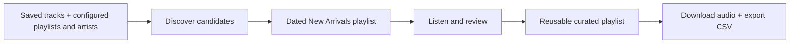
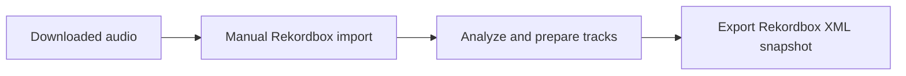
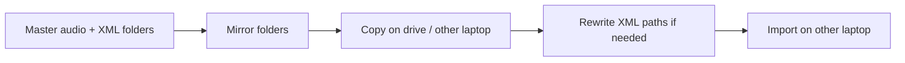
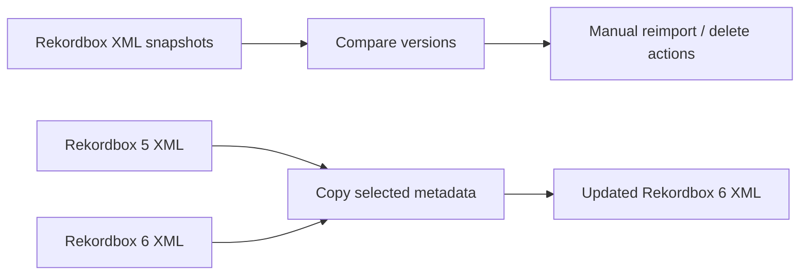
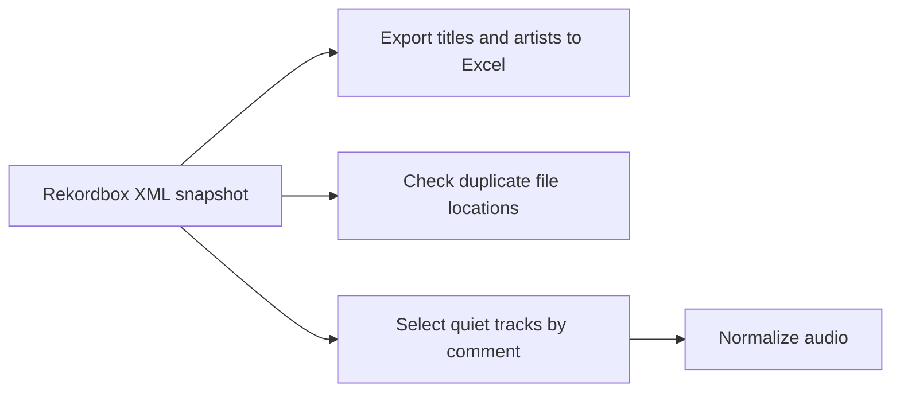

# Song-Manager at a glance

Song-Manager supports the following music-library workflows:

| Feature | Status |
| --- | --- |
| Discover and acquire tracks from Spotify | Operational |
| Prepare the DJ library in Rekordbox | Manual |
| Synchronize the library across devices | Operational |
| Compare and migrate Rekordbox XML | Manual / legacy |
| Run health checks on the Rekordbox library | Partial — see individual checks below |

## Core workflows

### 1. Discover and acquire tracks

The discovery service reads saved tracks and user-configured playlists and
artists. It creates a dated **New arrivals YYYY-MM-DD** playlist from newly
found playlist and artist tracks; saved tracks update the local history but are
not included in that playlist. Promising tracks are manually added to a
user-chosen curated playlist, which is then downloaded. The intended workflow
reuses that playlist so its Spotify identifier stays stable in local
configuration while its tracks change. The maintainer's playlist is called
**Found on the Road**; other users can choose any name.

**Responsible services:** `spotify_discovery`, `spotify_downloader`  
**Status:** Operational — both have launchers.

### 2. Prepare the DJ library

There is no automated hand-off between Spotify and Rekordbox; the user chooses
and imports the downloaded audio.

**Responsible:** Rekordbox and the user  
**Status:** Manual — Song-Manager does not automate importing or preparation.

### 3. Synchronize the library

The master folders are authoritative. Synchronization mirrors them to the
destination, including removal of files no longer present in the master.

**Responsible service:** `rekordbox_syncer`  
**Status:** Operational.

### 4. Compare and migrate Rekordbox XML

**Responsible services:** `rekordbox_syncer`, `rekordbox_migration`  
**Status:** XML comparison is manual. Rekordbox 5 → 6 migration is
legacy/manual.

### 5. Run health checks on the Rekordbox library

**Responsible service:** `rekordbox_maintenance`  
**Features and status:**

- Export a sorted title/artist list to Excel — Operational
- Check duplicate `@Location` values in an XML export — Documented/research
  only; the referenced `check_for_duplicates.py` is not currently in the
  service
- Select tracks marked as quiet and normalize their audio — Experimental repair
  action; the current script copies selected tracks, but its normalization call
  is disabled

Statuses describe the current code paths, not automated test coverage; the
repository does not yet have a dedicated test suite. Last reviewed:
**2026-08-22**.

## Detail when needed

Service READMEs contain command-specific setup and troubleshooting. Shared
code lives in `libs/`: `spotify_client` holds Spotify models,
`rekordbox_client` reads and edits Rekordbox XML, and `song_common` configures
logging.
