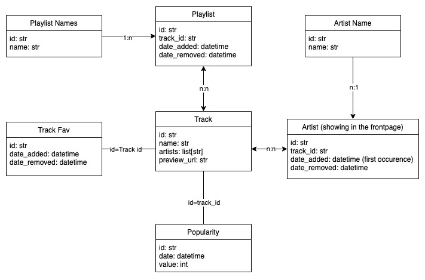

# Developement

This section is all about how to develop in this project. It also explains some internal processes in more detail.

## Spotify

### Spotify Playlist Creation

The playlist is created based on a database, containing `.csv` files. This is how the database is structured:

With this database, the following process is used to create the 'new tracks' playlist:

1. Compare the current `.csv` files to the previous ones and create a table with all songs, that are only present in the newest `.csv` files.
2. Remove songs, that are already saved (using the `Track Fav` table)
3. Apply limits (according to the configuration) to each playlist so that there are not added too many songs.
   > [!NOTE]
   > If there are 10 new songs found in a playlist, but the limit is set to 6, the 6 **most popular** songs are added. For that, the popularity information provided by spotify is used.
4. Create the playlist with the remaining songs.
