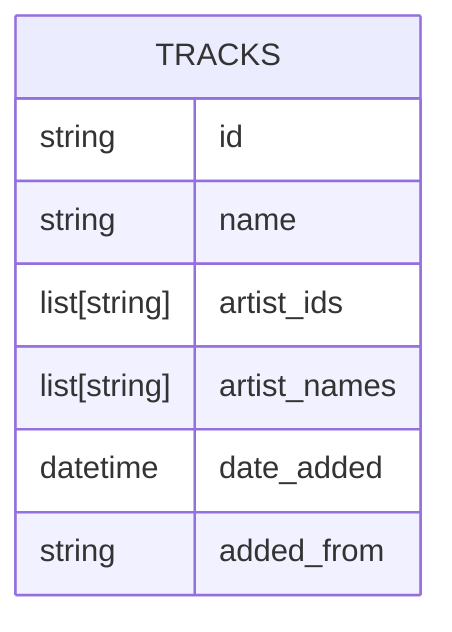

# Development

This section is all about how to develop in this project. It also explains some internal processes in more detail.

## Spotify

### Spotify Discovery - 'New Arrivals' playlist

The playlist is created based on a tracks table, stored as a `.parquet` file with the following schema:

With this database, the following process is used to create the 'new tracks' playlist:

1. Update the tracks table with the newest songs:
	1. find the latest favorite tracks and add them
	2. get current state of playlists and artists
	3. add `n` new tracks for playlist and artist to the table, based on user preferences (the `n` most popular ones will be added) - make sure not to add duplicates
2. Create the playlist based on the new tracks added today: only include tracks, that are added from playlists or artists, not from favorites.
