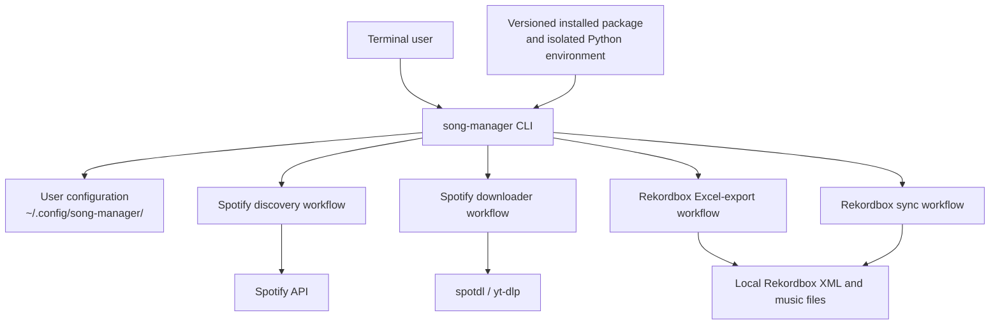
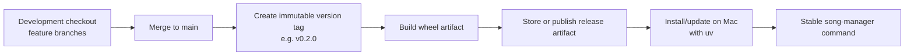

# Stable CLI Architecture

## Purpose

Provide a stable, globally available `song-manager` command on macOS. Daily
music-library workflows must keep working while the development checkout is on
another branch or contains unfinished changes.

The command-line interface (CLI) is a launcher and user-facing interface. The
existing Spotify and Rekordbox Python workflows remain the implementation
behind it.

## Target user experience

```bash
song-manager arrivals
song-manager download
song-manager sync ssd
song-manager sync silver
song-manager export-tracknames
```

The user can run these commands from any directory. They should not need to
activate a virtual environment or know the location of a repository checkout.

## Architecture



### Responsibilities

| Component | Responsibility |
| --- | --- |
| `song-manager` CLI | Parse commands, show help, load configuration, validate inputs, and report failures clearly. |
| Existing service code | Perform Spotify, Rekordbox, download, and export work. |
| Installed environment | Hold Python, project dependencies, and the selected released version. Managed by `uv`. |
| User configuration | Hold secrets and machine-specific locations outside Git and outside the installed package. |
| System dependencies | Provide external tools such as `ffmpeg`; installed once on the Mac. |

## Configuration boundary

Personal configuration must not live in the installed artifact or be tied to a
Git branch. Store it in a macOS user configuration directory instead:

```text
~/.config/song-manager/
├── arrivals.env
├── downloader.env
├── sync-ssd.env
└── sync-silver.env
```

These files can contain Spotify credentials, playlists, local music paths,
Rekordbox XML paths, and drive-specific paths. The repository should retain
only safe `.env.example` files.

## Version and release flow



`main` is the newest integrated code; it may continue changing. A release tag
is immutable and is the version installed for everyday use. Updating should be
an intentional action, not an automatic copy from CI to the Mac.

## Implementation phases

1. **Create the CLI foundation.** Add a package and a console-script entry
   point named `song-manager`. Implement `--help` and one low-risk command.
2. **Wrap each existing workflow.** Add the commands listed above without
   duplicating the underlying Spotify/Rekordbox logic. Keep the current shell
   scripts as temporary backwards-compatible wrappers if useful.
3. **Move configuration outside the repository.** Teach the CLI to load and
   validate files from `~/.config/song-manager/`; provide sanitized examples in
   the repository.
4. **Package a release.** Build a Python wheel for a version tag and install it
   with `uv tool install` (or an equivalent isolated `uv` environment).
5. **Automate releases later.** A CI pipeline may build the wheel on version
   tags and attach it to a release. It should not need access to the Mac.
6. **Optional macOS conveniences.** Create Shortcuts or Automator apps that
   invoke the stable CLI commands for click-to-run workflows.

## Non-goals

- A standalone PyInstaller-style macOS executable is not the initial target.
  The project relies on configurable local paths and external tools, so a
  versioned Python CLI is easier to update and troubleshoot.
- This design does not remove the need for Python dependencies or `ffmpeg`.
  It makes their installation and virtual environment invisible during normal
  daily use.
